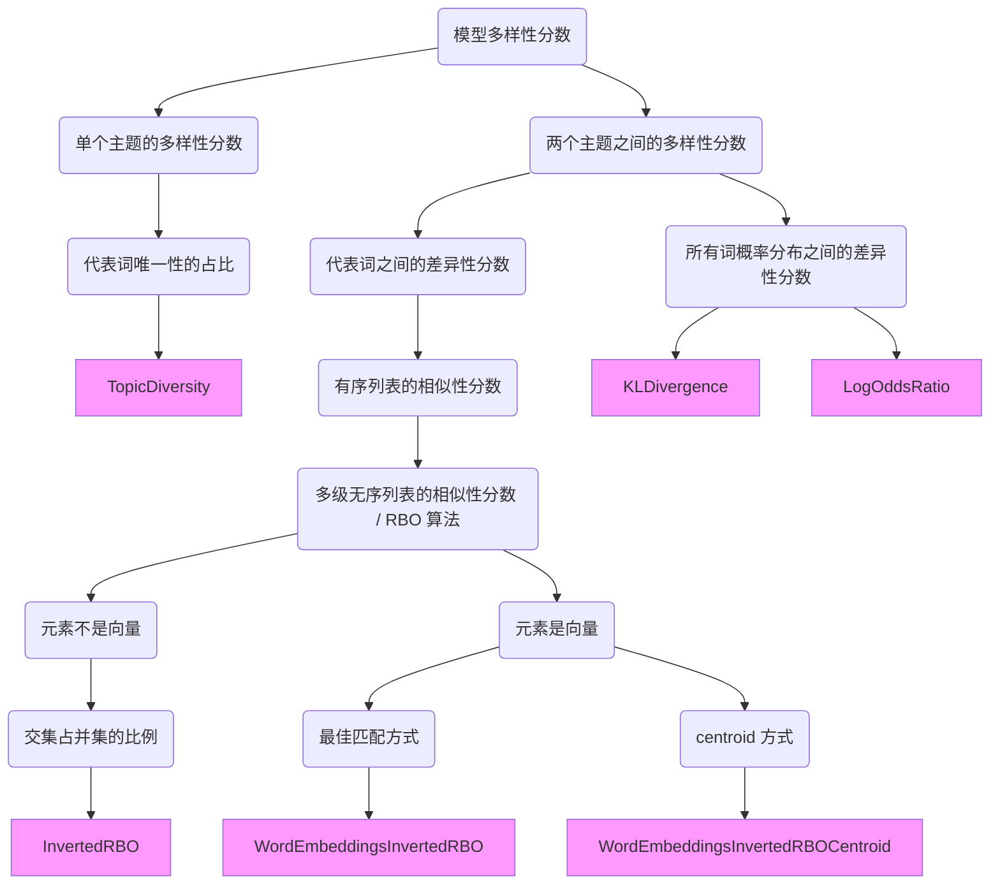

# 主题模型的评估

[TOC]

## 1. Human Interpret 人工评估

这部分主要参考论文: [Reading Tea Leaves: How Humans Interpret Topic Models](https://www.researchgate.net/publication/221618226)

如何去评估主题模型的好坏呢? 最开始的评估都是人去进行操作的, 比较经典的 (后续论文会提及的) 方法是 **word intrusion**。翻译成中文就是词入侵, 主要用于评估 topic_term_dists, 其方式如下:

对于每一个主题, 我们将其相关性最高的 topN 个词取出来, 然后再从其它主题的 topN 中随机选择一个词作为入侵词 (intruder), 组合在一起, 让标注人员 (turker) 去寻找入侵词。最终以选择入侵词的正确率作为评价指标。正确率越高, 意味着主题的可解释性越强。

除了评估 topic_term_dists 意外, 还有另一种综合评价的方法, 被称为 **topic intrusion**。方法如下:

1. 每一个主题, 我们用相关性最高的 topN 个词来表示这个主题
2. 给标注人员一篇文章和四个主题, 其中三个主题是这篇文章权重最高的 top3 主题, 剩下的一个主题是随机的, 我们记作 intruder_topic
3. 让标注人员从四个主题中选择 intruder, 被选择的主题记作 clicked_topic

最终的评价指标方式是:

$$
score = \log \frac{p(intruder\_topic|d)}{p(clicked\_topic|d)} \tag{1}
$$

由于 $p(intruder\_topic|d) \le p(clicked\_topic|d)$ , score 的值是小于或等于 0 的。将所有人的标注结果加起来, 越接近 0 说明模型的效果越好。

## 2. Topic Coherence 连贯性指标

这部分主要参考两篇论文: [Exploring the Space of Topic Coherence Measures](http://svn.aksw.org/papers/2015/WSDM_Topic_Evaluation/public.pdf) 和 [Optimizing Semantic Coherence in Topic Models](https://aclanthology.org/D11-1024.pdf) 。

人工评估的问题是成本太高了, 我们肯定希望有一种机器可以自己计算的方式, topic coherence 就是其中一种。coherence 的含义是连续性。

我们认为什么样的主题可解释性高呢? 一般情况下, 如果主题的 topN 权重词之间的相关性高, 我们就认为其可解释性强。那么怎么评估 topN 权重词之间的相关性呢?

对于一个 topic, 我们将其相关性最高的 topN 个 term 作为代表词。然后将这 N 个代表词两两配对, 构成 $\frac{N \cdot (N-1)}{2}$ 个二元组, 每一个二元组, 我们记作 $(w^\ast, w)$ , 其中 $w^\ast$ 的相关性分数高于 $w$ 。

比方说某一个 term 有四个代表词: {game, sport, ball, team} 。那么其可以构成六个二元组, 分别是 (game, sport), (game, ball), (game, team), (sport, ball), (sport, team) 和 (ball, team) 。

我们将一个 topic 下的所有二元组计算出来的连贯性分数取平均, 作为这个 topic 的连贯性分数, 将所有 topic 的连贯性分数取平均, 作为这个模型的连贯性分数。一般寻找 LDA 模型的最佳 topic 数就是比较不同 topic 下的模型连贯性分数。

那么怎么计算二元组的连贯性分数呢? 这里列出一些常用的计算方法。

**方法一**: 使用 PMI 进行计算, 即 $score = \mathbf{PMI}(w^\ast, w)$ , 其中联合概率 $p(w^\ast, w)$ 计算方式是两个词在窗口范围内共同出现的次数除以整个语料库的总词数, $p(w)$ 的计算方式是这个词在整个语料库中出现的次数除以总词数。

**方法二**: 将方法一中的 PMI 变成 NPMI, 即 $score = \mathbf{NPMI} (w^\ast, w)$

**方法三**: 使用条件概率来计算, 即 $score= \log p(w|w^\ast)$ , 计算方式是两个词在窗口范围内共同出现的次数处于 $w^\ast$ 在整个语料库中出现的次数。对这种方式不理解的参考 [文章](01_prob_basic.md) 的第一部分。

**方法四**: 计算 $w$ 和 $w^\ast$ 词向量之间的 cosine 相似度, 词向量使用 word2vec 算法得到, 即 $score = \cos (\vec{w}^\ast, \vec{w})$

**方法五**: 改变方法四中词向量的获得方式, 用 NPMI 的方式构建词向量: $\vec{w_i} = (\mathbf{NPMI}(\vec{w_i}, \vec{w_1}), \mathbf{NPMI}(\vec{w_i}, \vec{w_2}), \cdots, \mathbf{NPMI}(\vec{w_i}, \vec{w_n}))$

这五种方式是 gensim 中的 [coherencemodel](https://radimrehurek.com/gensim/models/coherencemodel.html) 支持的五种计算方式, 分别对应: `c_uci`, `c_npmi`, `u_mass`, `c_w2v` 和 `c_v` 。其中默认的方法是 `c_v` 。（注: UCI 和 UMass 都是大学名）

由于这些方法都具有高度的相似性, 因此有人提出将整个流程分为四部分: 代表词切分, 计算概率, 计算连贯性分数和聚合分数。然后再用 pipeline 的方式进行组装。gensim 中就是这么实现的, 我对这种实现方式呈保留态度。

上面五种方法对应 octis 中的 UCI Coherence, NPMI Coherence, UMass Coherence, Word Embedding-based Coherence Pairwise 和 C_V Coherence。除此之外, 其还实现了 Word Embedding-based Coherence Centroid 方法。其不是计算 **代表词对** 的分数, 而是直接计算每一个 **代表词** 的分数。

**方法六**: 将一个主题内所有代表词的词向量取平均, 作为这个 centroid 向量, 然后计算每一个代表词向量和 centroid 向量的 cosine 相似度, 作为这个代表词的分数。

## 3. Topic Diversity 差异性指标

这部分主要参考 [OCTIS](https://github.com/MIND-Lab/OCTIS) 的 API 文档。

差异性指标主要评估的是 "主题" 之间的差异性。我们认为, 模型生成的主题之间的差异性越大则越好。

模型的差异性分数怎么计算呢? 一种方式是每一个主题计算一个差异性分数, 然后对所有的主题求平均值; 另一种方式是将所有主题两两配对, 计算每一对主题之间的差异性分数, 然后对所有的分数求平均值。

这样, 模型的差异性分数就转化成了计算主题的差异性分数或者主题间的差异性分数。

求单个主题差异性分数的方式很简单, 就是判断当前主题的 代表词 在其它主题的 代表词 中未出现的百分比。或者说, 这个主题的 代表词 在所有主题的 代表词 中唯一性的占比。该方法由 [ETM](https://arxiv.org/pdf/1907.04907.pdf) 的作者提出。举例来说, 如果一个主题的 代表词 有三个词: {"房屋", "平方米", "建筑"}, 其中 "平方米" 这个词在其它主题的 代表词 中出现了, 而另外两个没有出现, 那么当前主题的多样性得分是 2/3 。这种方式在 OCTIS 种对应 `TopicDiversity`。

如何计算两个主题之间的差异性分数呢? 最简单比较两个主题之间差异性的方式, 就是比较两者在 term 上分布的差异:

+ Kullback-Liebler Divergence: KL 散度, 比较随机变量分布的经典方法, 具有非负性的特征, 取值大于 0, 值越大差异性就越大 (对应 OCTIS 中的 `KLDivergence`)
+ Log odds ratio: 概率比较的经典方法, 和 KL 散度的区别就在于没有 "标准化" 的过程, 作者在其中进行了取绝对值的操作, 值越大差异性就越大 (对应 OCTIS 中的 `LogOddsRatio`)

实际上在进行差异性指标的计算时, 我们只需要关注每一个主题中代表词的差异, 对于其它词的差异, 我们是不关心的。

怎么通过主题的代表词来衡量两个主题之间的差异性呢? OCTIS 的作者使用了一种很巧妙的方式, 将每一个主题的所有代表词作为一个 **有序列表**, 然后衡量两个有序列表的差异性。作者使用的是 RBO 算法。

RBO (rank-biased overlap) 主要用于比较两个有序列表 (ranked list)之间的相似性, 可以参考 [论文](http://w.codalism.com/research/papers/wmz10_tois.pdf), [博客1](https://changyaochen.github.io/Comparing-two-ranked-lists/) 和 [博客2](https://zhuanlan.zhihu.com/p/63279107), 其实基于 set/intersection based measure 的改进。

如果现在有 `['A', 'B', 'C', 'D', 'E']` 和 `['B', 'A', 'D', 'E', 'F']` 两个有序列表, 如何计算呢?

| 深度 k | 列表 1 的前 k 个元素 | 列表 2 的前 k 个元素 |  两个部分的并集  | 两个部分的交集 | 比例 | 平均比例 |
| :------: | :--------------------: | :--------------------: | :----------------: | :--------------: | :----: | :--------: |
|   1   |          A          |          B          |       A, B       |                | 0.00 |   0.00   |
|   2   |         A, B         |         B, A         |       A, B       |      A, B      | 1.00 |   0.50   |
|   3   |       A, B, C       |       B, A, D       |    A, B, C, D    |      A, B      | 0.50 |   0.50   |
|   4   |      A, B, C, D      |      B, A, D, E      |  A, B, C, D, E  |    A, B, D    | 0.60 |   0.53   |
|   5   |    A, B, C, D, E    |    B, A, D, E, F    | A, B, C, D, E, F |   A, B, D, E   | 0.67 |   0.55   |

对于不同的深度, 我们计算两者 **交集** 占 **并集** 的比例, 然后将所有的比例取平均值, 答案是 0.55 。这样的好处是: 1) 不要求两个有序列表中元素是完全相同的; 2) 靠前序列的相似性比靠后序列的相似性对最终分数的影响大。

当然这样的计算方式也是有问题的, RBO 就是基于其的改进, 主要是改进不同深度下的权重值, 这里先挖一个坑, 以后再填。

RBO 计算的是相似性分数, 取值范围在 `[0, 1]` 之间, 用 `1 - RBO` 的方式转换成差异性分数, 因此在 OCTIS 中记作 InvertedRBO, 对应 `InvertedRBO` 。

上面的方法实际上是将有序列表转换为不同深度下的 set 进行比较。在往外拓展, 如果所有的元素都是向量, 那么怎么计算两个 set 的相关性分数呢? 流程如下:

1. 将 set1 和 set2 中元素两两配对, 记作 pair_set, 对 pair_set 中的每一个 pair 计算 cosine 相似度
2. 找到 pair_set 中相似度最高的一组 pair, 记作 (w1, w2), 将分数加入到 res_list 中, 然后将 pair_set 中所有以 w1 开头的 pair 和所有以 w2 结尾的 pair 去除掉
3. 反复进行第二步操作, 直到 pair_set 集合为空
4. 对 res_list 中所有的数值取平均, 作为两个 set 的相关性分数

需要注意的是, res_list 列表中元素的个数等于 set1 集合中的元素个数。这种方法在 OCTIS 中对应 `WordEmbeddingsInvertedRBO` 。

有没有更简单的比较两个向量 set 的相关性分数呢? 有, 那就是直接对 set1 中的向量取平均, 作为 centroid1, 对 set2 中的向量取平均, 作为 centroid2, 然后计算两者的 cosine 相似度, 这种方法在 OCTIS 中对应 `WordEmbeddingsInvertedRBOCentroid` 。

这一部分的任务分解层数较多, 我们可以用下图来表示关系:

第一次用 mermaid 画图, 有点丑, 见谅, 参考: [Markdown画图](https://blog.csdn.net/qq_32708605/article/details/123801702)

OCTIS 中除了提供主题间的差异性计算方式, 也提供了主题间相似度的计算方式。相似度的计算方式和差异性的计算方式是相同的, 因此不做额外说明。需要注意的是, 我们期望的是主题之间的差异越大越好, 对应的相似度越小越好。(还有不要把相似性和连贯性弄混淆了, 这完全是两个概念)

## 4. Topic Significance 重要性指标

这一部分主要参考 [Topic Significance Ranking of LDA Generative Models](https://link.springer.com/chapter/10.1007/978-3-642-04180-8_22) 。

这里的主要思想是判断哪些 topic 是 junk topic。论文的作者列出了三种:

+ 如果 p(w|t) 的概率分布和 term 均匀分布相似
+ 如果 p(w|t) 的概率分布和 p(w) 相似
+ 如果 p(d|t) 的概率分布和 document 均匀分布相似

那么怎么计算两个概率分布之间的距离呢? KL 散度。当然论文中还提出了其它衡量方式, 比方说 cosine 距离等等, 这里就不提了。

自然是离 "垃圾" topic 的距离越远越好, 因此分数越大越好。KL 散度具有非负性, 因此它们的值都是大于 0 的。

OCTIS 在实现时, p(w) 是假设 document 的概率分布为均匀分布, p(d|t) 是假设所有 topic 的概率分布为均匀分布。

很显然, 本文作者提出的 "垃圾" topic 的三种特性, 只有第二种有一些难度, 其它两种难度较低, 这也导致了后续使用的人较少。

## 5. 分类指标

主题模型可以理解为构建文本向量的一种方式, 也可以理解为对 BoW 形式的文本向量的降维。文本向量一种简单的评估方式就是用其进行分类。分类的模型可以自己选, OCTIS 中用的是随机森林模型。分类任务常见的指标有四种, 分别是: F1 score, Precision, Recall 和 Accuracy 。

## 总结

本文总结了常用的主题模型评估方式。评估方式的选择和主题模型的使用有很大关系。如果是用主题模型去挖掘关键词 (word saliency), 那么可能更多的关注多样性指标, 如果用主题模型去挖掘文本标签, 那么应该更关注连贯性指标, 如果用主题模型构建文本向量, 那么应该更关注分类指标。

额外说明一点, 连贯性指标, 多样性指标和分类指标都是越大越好, 他们的取值范围多样化, 需要在使用时注意以下。
